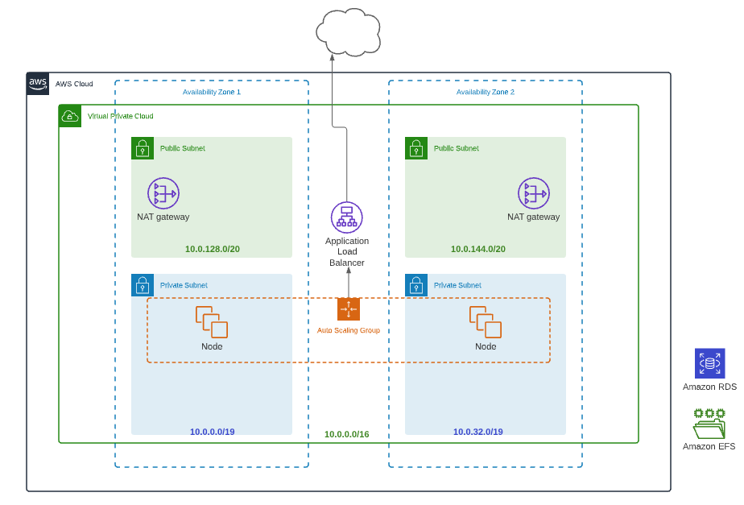

# Infrastructure as Code

## What to do
Engineering team has requested us to implement an application on-premise for internal use. We've agreed to implement this schema:

We need to implement every item on the schema. Our stack is AWS for cloud and preferibly Terraform for code, but we're open to use other tools, as we're always open to test and discover new things.

The recommendation to create this is to follow this order:

* VPC
* Subnets (public and private)
* Nodes with autoscaling group
* Amazon RDS (as DB for the application)
* Amazon EFS (for shared storage)
* Application Load Balancer for accessing the application

You can test yourself in a personal AWS account. Please, make sure to destroy the infra, as we don't want you to incur in any cost.

## Definition of Done

* Have coded the infrastructure

## Considerations

* Don't panic 😟 if the code is not fully working, we're looking for patterns and check that you understand the scenario and what is IaC and start working on it.
* Ask if you need some clarification ❓
* To finish the exercise the application is not important, you can use whatever application you want (for example a Debian with a simple nginx server is enough)

---

## BONUS (not mandatory 😉)

As bonus you can implement a way to access the instances to solve future problems
